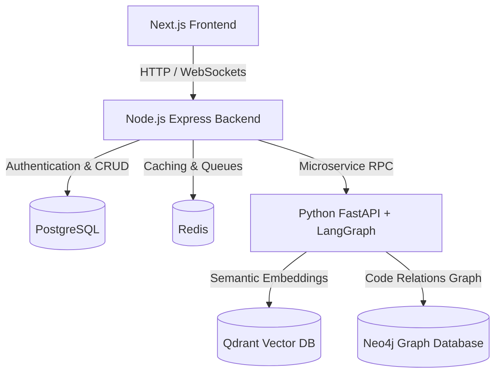

# CodePilot AI

CodePilot AI is an **Enterprise Agentic RAG (Retrieval-Augmented Generation) Platform** designed to help developers seamlessly understand, search, debug, and document large software repositories. By leveraging a modern Node.js backend, a specialized Python AI microservice, hybrid retrieval mechanisms, and multi-agent workflows, CodePilot AI transforms how development teams interact with codebase repositories.

---

## 🎯 Purpose

CodePilot AI is built to streamline developer workflows and enhance productivity across complex codebases by providing:
- **Repository Upload & Management:** Easily upload ZIP archives or connect directly via GitHub.
- **Intelligent Parsing & Chunking:** Smart segmentation of code structure, logic, and semantics.
- **Advanced Code Search & Retrieval:** Fast and precise retrieval using hybrid search.
- **Interactive Code Explanation:** In-depth, contextual explanations of files, classes, and functions.
- **Automated Documentation:** Generate clear, production-grade documentation on the fly.
- **Debugging & Diagnostic Assistance:** Help developers pinpoint bugs, trace logs, and resolve issues.
- **Citation-Backed QA:** Answers are backed by precise code block citations, reducing AI hallucinations.

---

## 🛠️ Architecture & Tech Stack

CodePilot AI features a decoupled, multi-service architecture designed for scalability, speed, and intelligence.

### Stack Components

| Layer | Technology | Purpose |
| :--- | :--- | :--- |
| **Frontend** | React, Next.js | Modern, responsive developer portal and interactive chat interface. |
| **Backend** | Node.js, Express | Directs traffic, handles authentication, queues file processing, and manages metadata. |
| **AI Service** | Python, FastAPI, LangGraph | Orchestrates the multi-agent cognitive architecture and parsing pipelines. |
| **Relational DB** | PostgreSQL | Handles user credentials, repository metadata, configurations, and chat history. |
| **Cache & Queue** | Redis | Job queue state management, session tokens, and caching layer. |
| **Vector DB** | Qdrant | Stores dense code embeddings for semantic retrieval. |
| **Graph DB** | Neo4j | Maps structural relationships (calls, imports, inheritances) for GraphRAG. |

---

## 🚀 Scope (Version 1)

The initial release (V1) implements the core pipeline required for end-to-end repository search and analysis:
- [x] **Secure Authentication:** User sign-up, login, and secure session management.
- [x] **Repository Upload:** Uploading codebases via direct ZIP uploads or linking GitHub repositories.
- [x] **Parsing & Processing:** Intelligent AST parsing, chunking, and embedding generation.
- [x] **Hybrid Search:** Combines BM25 lexical search and dense Vector search with reranking.
- [x] **Multi-Agent Orchestration:** Agent workflows for code analysis, reasoning, and plan generation.
- [x] **Citations & History:** Chat history persistence and precise citations mapping answers to original files.
- [x] **Docker Deployment:** Fully containerized setup for local and production-ready deployments.

---

## 📋 Requirements

### Functional Requirements
1. **User Authentication:** JWT-based user login, signup, password hashing, and session verification.
2. **Repository Upload & Management:** Uploading, tracking indexing status, and deleting repositories.
3. **Intelligent Code Parsing:** Language-aware parsing (JS, TS, Python, Go, Java, etc.) to extract syntax trees.
4. **Hybrid Retrieval:** Multi-stage retrieval combining BM25 keyword matching, vector embeddings, and cross-encoder reranking.
5. **GraphRAG:** Leveraging entity and relation extraction mapped in Neo4j to query across file dependencies.
6. **Multi-Agent Orchestration:** Coordinating expert agents (Search Agent, Writer Agent, Debug Agent) using LangGraph.
7. **Conversation History:** Storing structured message exchanges to preserve conversation context.
8. **Documentation Generation:** Auto-generation of READMEs, API endpoints documentation, and module summaries.

### Non-Functional Requirements
*   **Performance:** Under **5 seconds** query response times post-indexing.
*   **Security:** JSON Web Tokens (JWT) for APIs, HTTPS communication, and secure password hashing algorithms (e.g., bcrypt).
*   **Scalability:** Horizontal scaling of ingestion workers to support multiple concurrent users and large codebases.
*   **Maintainability:** Decoupled modular services, clean interfaces, containerization via Docker, and comprehensive test coverage.

---

## 👥 User Stories

1. **Upload & Query:** As a developer, I want to upload my backend repository and ask natural language questions about its routing logic so I can onboard quickly.
2. **Understand Auth Flow:** As a security auditor, I want to ask "Explain the authentication flow in this codebase" and get a step-by-step trace of middle-wares and controllers.
3. **Generate Docs:** As a tech lead, I want to auto-generate markdown API documentation for a set of controllers to keep our external docs up to date.
4. **Analyze Logs:** As a DevOps engineer, I want to paste error logs into the chat and have CodePilot find the failing files/lines in the repository.
5. **Citations:** As a developer, I want all answers to point directly to the source file name and lines so that I can verify the correctness of the answer.

---

## 🏁 Acceptance Criteria

The system is considered ready when the following elements are fully integrated and verified:
- [x] **Authentication:** Sign-in and token validation work across frontend and backend.
- [x] **Repository Upload:** ZIP files and GitHub repositories are parsed and indexed without data loss.
- [x] **Parsing & Embeddings:** Files are parsed, chunked, and embedded into Qdrant & Neo4j.
- [x] **Hybrid Search:** Search combines keyword search and vector similarity search.
- [x] **Multi-Agent Workflow:** Agent-based routing directs user queries to the appropriate specialized worker.
- [x] **Chat with Citations:** The interface outputs references to source files with line numbers.
- [x] **History:** Chats persist across browser sessions.
- [x] **Docker Deployment:** Single command initialization via `docker-compose`.